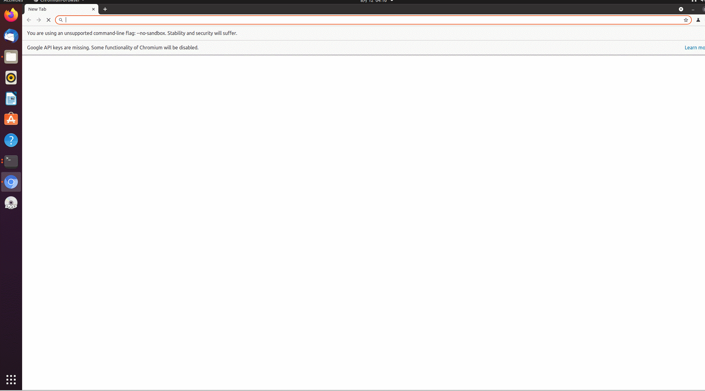

# CVE-2021-30551

My exp for chrome V8 CVE-2021-30551

You can found your chrome version by chrome://version

or go to http://whatsmyuseragent.org/

You can set up a webserver locally using python like:

```py
python3 -m http.server 8080
```

And the test it by accessing http://127.0.0.1:8080



## reference

[google project zero](https://googleprojectzero.github.io/0days-in-the-wild/0day-RCAs/2021/CVE-2021-30551.html)
